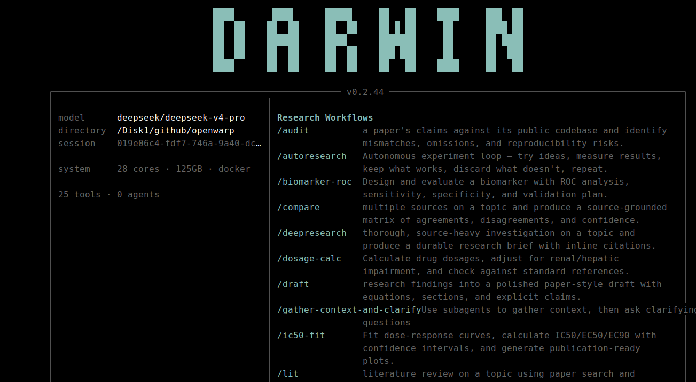

<p align="center">
  <a href="https://github.com/yejunbin/darwin">
    
  </a>
</p>
<p align="center">开源 AI 生物医学研究生成式代理</p>

---

### 关于 Darwin

Darwin 是基于 [feynman](https://github.com/getcompanion-ai/feynman) 深度修改而来的生物医学生成式代理。feynman 是通用型 AI 研究代理，而 Darwin 专注于生命科学领域的**系统文献综述、临床证据分级和可重复的计算机模拟方案**。

核心能力：
- **循证研究** — 遵循 PRISMA 指南的系统综述和荟萃分析
- **临床证据分级** — 证据层级强制执行（RCT > 队列研究 > 预印本），并内联撤稿检查
- **可重复方案** — 湿实验和计算流程，附带 MIQE/CONSORT/ARRIVE 检查清单
- **生物信息学整合** — BLAST、通路富集、GEO 重分析、AlphaFold 结构评估
- **标准命名法** — 全文使用 HGNC 基因符号、RRID、UniProt ID、ChEMBL ID

基于 [Pi](https://github.com/badlogic/pi-mono) 代理运行时构建，生物医学能力通过 Pi 技能交付 —— 启动时同步到 `~/.darwin/agent/skills/` 的 Markdown 指令文件。

---

### 安装

**从源码安装（开发模式）：**

```bash
git clone https://github.com/yejunbin/darwin.git
cd darwin
npm install
npm run build
```

然后创建符号链接，使 `darwin` 命令可在 PATH 中使用。`npm link` 在新终端中有时会失败（nvm 未加载），因此推荐手动创建符号链接：

```bash
mkdir -p ~/.local/bin
ln -s $(pwd)/bin/darwin.js ~/.local/bin/darwin
# 确保 ~/.local/bin 在 PATH 中
export PATH="$HOME/.local/bin:$PATH"
```

要使 PATH 在新终端中持久生效，将其添加到 shell 配置：

```bash
echo 'export PATH="$HOME/.local/bin:$PATH"' >> ~/.bashrc
```

或使用 zsh：

```bash
echo 'export PATH="$HOME/.local/bin:$PATH"' >> ~/.zshrc
```

或者，如果您的 nvm 配置可在各终端间正常工作，`npm link` 也可以使用：

```bash
npm link
```

若不创建任何链接，可直接使用 `node ./bin/darwin.js` 运行。

**环境要求：**
- Node.js >= 20（已测试至 v25）
- npm 或 yarn

**配置模型提供商：**

```bash
darwin setup
```

从支持的提供商中选择，包括 DeepSeek、OpenAI、Anthropic，或通过 LM Studio / Ollama / vLLM 使用本地模型。

---

### 输入 -> 输出

```
$ darwin "heart failure 中 GLP-1 激动剂的系统综述"
-> 搜索 PubMed、临床试验，生成 PRISMA 合规综述

$ darwin systematic-review "镰状细胞病的 CRISPR 碱基编辑"
-> 多代理系统综述，附带证据分级

$ darwin target-dossier "KRAS G12C"
-> 包含可药性评估的综合靶点档案

$ darwin trial-tracker "donanemab 阿尔茨海默病"
-> 临床试验全景及监管里程碑

$ darwin retraction-sweep "淀粉样蛋白假说"
-> 扫描该领域的撤稿和勘误

$ darwin protocol "RNA-seq 差异表达"
-> MIQE 合规的可重复方案
```

---

### 工作流

自然语言提问，或使用斜杠命令快捷操作。

| 命令 | 功能 |
| --- | --- |
| `/deepresearch <主题>` | 带证据层级的多代理深度调查 |
| `/systematic-review <主题>` | PRISMA 合规的系统综述或荟萃分析 |
| `/lit <主题>` | 基于 PubMed、bioRxiv 和原始文献的文献综述 |
| `/target-dossier <基因/蛋白>` | 综合靶点验证和可药性评估 |
| `/trial-tracker <药物/适应症>` | 临床试验全景和监管里程碑 |
| `/retraction-sweep <主题>` | 扫描撤稿、勘误和关切声明 |
| `/protocol <名称>` | 起草可重复的湿实验或计算机模拟方案 |
| `/biomarker-roc <标志物+疾病>` | 生物标志物性能评估及 ROC 分析 |
| `/dosage-calc <药物+患者>` | 考虑器官调整的用药剂量计算 |
| `/ic50-fit <化合物+数据>` | 四参数逻辑回归及置信区间拟合 |
| `/review <成果>` | 带报告检查清单的生物医学同行评审 |
| `/audit <项目>` | 证据完整性审计 |
| `/compare <主题>` | 来源对比矩阵 |
| `/draft <主题>` | 基于研究发现的手稿式草稿 |
| `/watch <主题>` | 定期文献监控 |
| `/outputs` | 浏览所有生物医学成果 |

---

### 代理

内置六个生物医学代理，自动调度。

- **bio-researcher** — 跨 PubMed、临床试验、bioRxiv 和监管文件收集原始证据
- **clinical-researcher** — 从 RCT、系统综述和指南中收集并评估临床证据
- **bioinformatician** — 设计并执行可重复的生物信息学流程和计算机模拟分析
- **bio-reviewer** — 模拟生物医学同行评审，含领域特定检查清单（CONSORT、ARRIVE、MIQE、PRISMA）
- **bio-writer** — 结构化手稿、方案和证据摘要
- **evidence-verifier** — 内联引用、来源验证、撤稿检查和证据层级强制执行

---

### 技能与工具

- **PubMed 搜索** — 带 MeSH 词的结构化查询，检索同行评审文献
- **bioRxiv / medRxiv 监控** — 跟踪同行评审前的预印本
- **临床试验检查** — ClinicalTrials.gov 和 EU CTR 搜索
- **撤稿检查** — 引用前验证论文完整性
- **基因查询** — HGNC、OMIM、ClinVar、UniProt 查询
- **通路富集** — ORA 和 GSEA 指导
- **AlphaFold 获取** — 检索并评估预测结构
- **统计检查** — 审计统计方法和 p-hacking 迹象
- **BLAST** — 序列比对和同源基因搜索
- **GEO 重分析** — 重分析公共数据集以验证
- **生物标志物 ROC** — 诊断/预后性能评估
- **剂量计算** — 基于标准参考文献的肾/肝调整
- **IC50 拟合** — 四参数逻辑回归及置信区间
- **网页搜索** — Exa、Perplexity 或 Gemini API 获取当前话题
- **会话搜索** — 跨既往研究会话的索引式回溯
- **预览** — 生成成果的浏览器和 PDF 导出

---

### 工作原理

基于 [Pi](https://github.com/badlogic/pi-mono) 代理运行时构建，生物医学能力通过 [Pi 技能](https://github.com/badlogic/pi-skills) 交付 —— 启动时同步到 `~/.darwin/agent/skills/` 的 Markdown 指令文件。

所有输出均基于来源，并尊重证据层级：
- 同行评审系统综述和 RCT > 队列研究 > 预印本
- 引用前进行撤稿检查
- 计算机模拟结果明确标注，绝不作为湿实验已确认结果呈现
- 标准命名法：HGNC 基因符号、RRID、UniProt ID、ChEMBL ID

---

### 参与贡献

详见 [CONTRIBUTING.md](CONTRIBUTING.md) 完整贡献指南。

```bash
git clone https://github.com/yejunbin/darwin.git
cd darwin
nvm use || nvm install
npm install
npm test
npm run typecheck
npm run build
```

[文档](https://github.com/yejunbin/darwin) - [更新日志](RELEASES.md) - [MIT 许可证](LICENSE)
